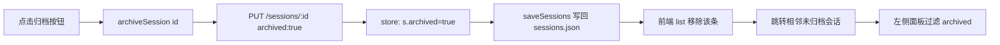

## 用户需求

将会话的"删除"功能改为"归档"功能：归档后对话数据仍保留在 `server/data/sessions.json` 中，但不再显示在左侧会话面板里。

## 产品概述

左侧会话列表中的"删除对话"操作，从物理删除改为软归档。归档仅给会话打上 `archived: true` 标记，数据不丢失；列表过滤掉已归档项。彻底删除接口（物理删除）保留不动，供后续恢复/彻底删除 UI 复用。

## 核心特性

- 左侧会话项的"×"按钮改为"归档"语义（文案与提示更新），点击后该会话被标记为归档
- 归档后该会话立即从左侧面板消失，URL 自动跳转到相邻未归档会话
- 归档数据持久化在 `sessions.json`（标记 `archived: true`，消息内容不删）
- 删除项目时，其下所有会话一并改为归档（级联软删除，不再物理丢弃）
- 现有 `DELETE /sessions/:id` 物理删除接口保留，不被改动

## 技术栈

- 前端：Vue 3（`<script setup>`）+ Composition API，状态层 `src/sessions.js`（reactive）
- 后端：Node.js + Express，`server/routes/sessions.js` 路由 + `server/lib/store.js` 内存存储（Map）+ `sessions.json` 持久化
- 复用现有 `PUT /sessions/:id` 补丁接口实现归档，不新增端点

## 实现方案

### 总体策略

复用既有架构：归档 = 调用已有的 `PUT /sessions/:id` 写入 `{ archived: true }`，后端 `store.js` 在 `saveSessions()` 时原样序列化整个 Map（含 `archived` 字段），前端 `groupedConversations` 计算属性过滤掉 `s.archived` 的项。物理删除接口 `DELETE` 完全保留。

### 关键技术决策

1. **复用 PUT 而非新增端点**：`PUT /sessions/:id` 已支持 title/messages 补丁，扩展支持 `archived` 字段零成本，避免新增路由与前端请求方法。
2. **数据保留天然成立**：`saveSessions()` 序列化整个 `sessions` Map，只要不执行 `sessions.delete()`，归档项永远在文件中。
3. **级联改为归档**：`deleteSessionsByProject` 由 `sessions.delete(sid)` 改为 `s.archived = true`，与"删除即归档"一致，且保留历史对话。
4. **彻底删除接口保留**：`DELETE /sessions/:id` 物理删除逻辑不动，后续恢复/彻底删除 UI 可直接复用。

### 性能与可靠性

- `sessions.json` 写入为同步全量序列化（`saveSessions` 已有），归档操作频率低，无性能瓶颈。
- 前端过滤在 `groupedConversations` 计算属性内增加一行 `!s.archived`，时间复杂度 O(n) 不变。
- 向后兼容：历史 `sessions.json` 无 `archived` 字段，`!s.archived` 为 `true`，旧会话正常显示，无回归。

## 实现注意事项

- `App.vue` 的 `removeSession` 当前会物理删除并跳转；改为：调用归档请求 → 成功后从 `sessions.list` 移除该条目（前端隐藏）→ 跳转相邻未归档会话。注意过滤"相邻会话"时排除已归档项，避免跳到隐藏会话。
- `confirmRemoveProject` 删除项目后，前端 `sessions.list` 已 `filter` 掉该项目会话；后端 `deleteSessionsByProject` 改为归档后，这些会话在文件中保留但前端不显示，行为一致。
- 归档请求失败时应中断跳转（catch 后 return），保持现有错误处理模式。
- 按钮 `title` 与可见文案从"删除对话"改为"归档对话"，其余样式不变，避免大范围重构。

## 架构设计



左侧面板渲染：`groupedConversations` 在 `sorted` 阶段 `.filter(s => !s.archived)`，归档项不进入任何分组。

## 目录结构

```
server/
├── routes/
│   └── sessions.js          # [MODIFY] PUT 处理器支持写入 archived 字段；DELETE 保持物理删除不动
└── lib/
    └── store.js             # [MODIFY] 会话类型注释加 archived?:boolean；deleteSessionsByProject 改为标记 archived=true 并保存
src/
├── sessions.js              # [MODIFY] 新增 archiveSession(id)（调 PUT 带 archived:true）；列表移除归档项
└── App.vue                  # [MODIFY] groupedConversations 过滤 archived；删除按钮改归档文案/行为；removeSession 改归档逻辑
```

## 关键代码结构

```js
// server/lib/store.js 会话结构（类型注释增强）
export const sessions = new Map()
// 会话对象: { id, projectId, title, messages, createdAt, updatedAt, archived?: boolean }

// server/routes/sessions.js PUT 增强（在现有 title/messages 处理后追加）
if (typeof archived === 'boolean') s.archived = archived

// 前端 src/sessions.js 新增
export async function archiveSession(id) {
  const session = await request(`/api/sessions/${id}`, {
    method: 'PUT',
    body: JSON.stringify({ archived: true }),
  })
  sessions.list = sessions.list.filter((s) => s.id !== id)
  return session
}
```