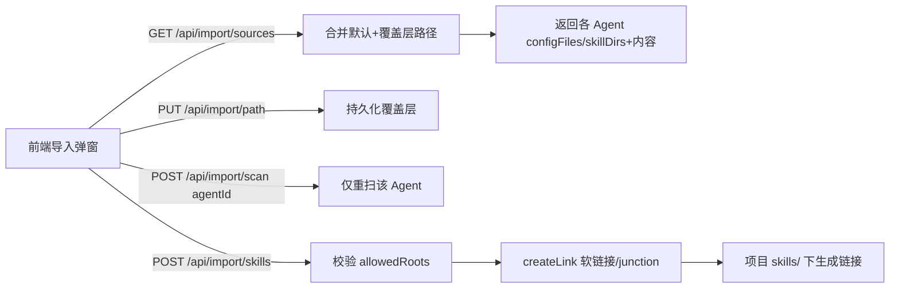

## 用户需求概述

在现有「从其他 Agent 导入」功能基础上，扩展来源并支持用户自定义、持久化配置文件路径，导入时改用软链接。

## 核心功能

- 新增三个 Agent 来源：opencode、codex、hermes，分别探测其 MCP 配置文件与 skills 目录（常规命名路径）。
- 导入弹窗中显示每个 Agent 的 MCP 配置文件路径与 skills 目录路径。
- 用户可手动编辑上述路径并提交，后端持久化保存（下次打开仍带出）。
- 用户修改某 Agent 路径后，可触发「重新扫描该 Agent」，仅对该 Agent 用新路径重新解析其 mcp 与 skills。
- Skill 导入从「复制目录」改为「创建软链接」：非 Windows 用目录符号链接，Windows 用 junction（普通用户免提权）。导入后项目 skills/ 下为链接而非副本，来源更新自动跟随。

## 边界与说明

- MCP 本身只读配置写入本地设置不涉及文件复制，软链接诉求作用于 Skill 导入。
- 用户自定义路径需持久化，写入后端独立配置文件（不影响默认候选）。
- 单 Agent 重扫不触发全量扫描，仅刷新该来源。
- 安全校验保留：写入软链接目标固定为项目 skills/ 下，来源目录仍可配置但需合法。

## 技术栈

- 后端：Node.js + Express（ESM），使用内置 `fs` / `fs/promises`、`path`、`os`。
- 前端：Vue 3 + Ant Design Vue + lucide 图标（维持现状）。

## 实现方案

### 总体策略

在 `server/index.js` 中：重构来源常量支持「可被用户覆盖的路径」，新增 opencode/codex/hermes，新增持久化覆盖层与两个新 API，并将 Skill 导入复制改为跨平台软链接。前端两个导入弹窗新增「路径编辑 + 单 Agent 重扫」交互，复用现有弹窗数据。

### 关键技术决策

1. **来源模型扩展（可覆盖路径）**

- 将 `MCP_SOURCE_CANDIDATES` 与 `SKILL_SOURCE_DIRS` 统一扩展为含 `id`、`label`、`configFiles`（数组）、`skillDirs`（数组）的结构；新增三款 Agent：
    - opencode: `~/.config/opencode/`、`~/.opencode/` 下 `mcp.json`/`settings.json`；skills 为二者下 `skills/`
    - codex: `~/.codex/` 下 `config.json`/`settings.json`；skills `~/.codex/skills`
    - hermes: `~/.hermes/`、`~/.config/hermes/` 下 `config.json`/`settings.json`；skills 为二者下 `skills/`
- 路径用 `os.homedir()` 拼接，沿用现有写法。

2. **持久化覆盖层**

- 新增 `IMPORT_PATHS_FILE`（参考 `PROJECTS_FILE` 的 `readFileSync`/`writeFileSync` 模式），结构 `{ [agentId]: { configFiles:[], skillDirs:[] } }`。
- 启动时加载，覆盖默认路径；`GET /api/import/sources` 返回「最终生效路径」并附 `isOverridden` 标记。

3. **新增 API**

- `GET /api/import/sources`（改）：返回每个 agent 的 `configFiles`、`skillDirs`（可编辑）与 `isOverridden`。
- `PUT /api/import/path`：body `{ agentId, configFiles?, skillDirs? }`，写入覆盖层持久化，返回成功。
- `POST /api/import/scan`：body `{ agentId }`，仅用该 agent 当前生效路径重新扫描 mcp + skills 返回（与 GET 单 agent 子集一致）。

4. **Skill 软链接**

- 新增 `createLink(src, dest)`：非 win32 → `fsp.symlink(src, dest, 'dir')`；win32 → `fsp.symlink(src, dest, 'junction')`。目标已存在则标记 `exists`。
- `POST /api/import/skills` 用 `createLink` 替换 `copyDirRecursive`，保留 `allowedRoots` 校验（来自生效后 skillDirs）。保留 `copyDirRecursive` 防回归。
- 返回 `status` 复用 `'imported'`（注释说明为软链接）。

### 性能与可靠性

- 软链接为 O(1) 操作，远低于递归复制；单 Agent 重扫范围小，无性能回退。
- 安全校验 `allowedRoots` 保持严格前缀匹配，软链接目标固定写入项目 `skills/`，防止越权。
- 错误捕获：单条链接/单 Agent 扫描失败不影响其它项，返回 `status:'error'` 与原因。

### 避免技术债

- 复用现有常量结构、扫描函数与 projects.json 持久化模式，不引入新依赖。
- 跨平台分支仅集中于一处工具函数。

## 实现注意事项

- 软链接前确保 `projectSkills` 目录存在（现有逻辑已创建）。
- Windows junction 的 `src` 需绝对路径（扫描结果已为绝对路径）。
- 导入弹窗「自动启用」逻辑不受影响（GET /api/skills 跟随链接读取）。

## 架构设计



## 目录结构

```
server/
└── index.js        # [MODIFY] 1) 重构来源常量+新增 opencode/codex/hermes；2) 新增 IMPORT_PATHS_FILE 持久化；3) 新增 createLink；4) 改 GET/PUT/POST 三个导入 API；5) POST /api/import/skills 改软链接
src/api/agent.js    # [MODIFY] 新增 saveImportPath()、scanImportAgent()；fetchImportSources() 适配新返回结构
src/components/
├── SkillsSettings.vue  # [MODIFY] 导入弹窗新增路径编辑+单 Agent 重扫
└── McpSettings.vue     # [MODIFY] 导入弹窗新增路径编辑+单 Agent 重扫
```

## 关键代码结构

```js
// 跨平台软链接（Windows 用 junction 免提权）
async function createLink(src, dest) {
  const type = process.platform === 'win32' ? 'junction' : 'dir'
  await fsp.symlink(src, dest, type)
}
```

## 设计风格

采用与现有设置页一致的简洁卡片式布局，延续中性灰白底色、圆角卡片与轻阴影。导入弹窗内每个 Agent 作为独立分组卡片，顶部显示 Agent 名称与「重新扫描」按钮，卡片内分两栏：MCP 配置路径（可编辑 input）与 Skills 目录路径（可编辑 input），下方列出扫描到的可勾选项。路径编辑区在失焦或点击「保存路径」后调用持久化接口，状态变化有轻量反馈。

## 页面区块（导入弹窗内）

- 顶部说明：简短描述「可编辑各 Agent 配置路径后局部重扫」。
- 来源分组卡片（每个 Agent 一张）：
- 头部：Agent 名称 + 是否被覆盖标记 + 「重新扫描」按钮（loading 态）。
- 路径编辑区：MCP 配置文件路径 input（多路径可逗号分隔或仅主路径）、Skills 目录路径 input；「保存路径」「恢复默认」操作。
- 内容区：该 Agent 下扫描到的 MCP Server / Skill 列表，可勾选。
- 底部操作：取消 / 导入所选（数量）。

## Agent Extensions

### SubAgent

- **code-explorer**
- 用途：在修改前确认 `copyDirRecursive`、`allowedRoots`、`MCP_SOURCE_CANDIDATES`、`SKILL_SOURCE_DIRS` 的所有引用点，以及前端两个弹窗组件对返回结构的依赖，避免遗漏回归。
- 预期结果：输出 `server/index.js` 与两个 `.vue` 文件内相关符号引用清单，确认修改范围仅限后端导入逻辑与两处弹窗 UI。