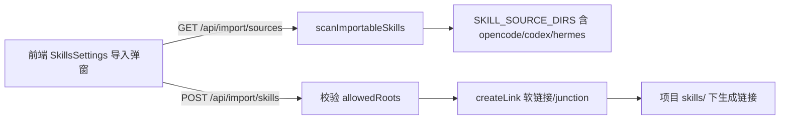

## 用户需求概述

在现有「从其他 Agent 导入」功能基础上，扩展支持的 Agent 来源，并将 Skill 导入从「复制文件」改为「软链接」以避免文件重复。

## 核心功能

- 新增三个 Agent 来源的扫描支持：opencode、codex、hermes，分别探测其 MCP 配置文件与 skills 目录。
- MCP 导入来源候选（MCP_SOURCE_CANDIDATES）新增上述三款 Agent 的配置文件路径。
- Skills 导入来源目录（SKILL_SOURCE_DIRS）新增上述三款 Agent 各自的 skills 目录。
- Skill 导入逻辑改为创建软链接（符号链接）：非 Windows 使用目录符号链接；Windows 下使用 junction，普通用户无需提权即可创建。
- 保持来源路径安全校验（仅允许来自已声明的 Agent 目录），防止越权链接任意目录。
- 导入后项目 skills/ 下生成的是链接而非目录副本，来源更新时项目内自动跟随变化。

## 边界与说明

- MCP 本身仅读取配置写入本地设置，不涉及文件复制，故「软链接」诉求实际作用于 Skill 导入。
- 跨平台兼容：Windows 自动降级为 junction。
- 前端导入弹窗与提示文案无需大改，仅需适配后端返回的链接状态。

## 技术栈

- 后端：Node.js + Express（ESM），使用内置 `fs` / `fs/promises`、`path`、`os`。
- 前端：Vue 3 + Ant Design Vue + lucide 图标（维持现状，仅调用 API）。

## 实现方案

### 总体策略

在 `server/index.js` 中扩展已有的两个来源常量，并新增一个跨平台的软链接创建工具函数，将 `POST /api/import/skills` 的复制逻辑替换为软链接逻辑。复用现有 `allowedRoots` 安全校验与 `scanImportableSkills` 的扫描流程，不改动前端交互结构。

### 关键技术决策

1. **新增来源路径（常规命名推断）**

- opencode：`~/.config/opencode/`（及其 `mcp.json`/`settings.json`）、`~/.opencode/`；skills 目录 `~/.config/opencode/skills` 与 `~/.opencode/skills`。
- codex：`~/.codex/`（config 或 settings）；skills 目录 `~/.codex/skills`。
- hermes：`~/.hermes/`、`~/.config/hermes/`；skills 目录 `~/.hermes/skills` 与 `~/.config/hermes/skills`。
路径统一用 `os.homedir()` 拼接，沿用现有 `join(home, ...)` 写法。

2. **软链接工具 `createLink(src, dest)`**

- 非 Windows：`fs.symlink(src, dest, 'dir')`。
- Windows：`fs.symlink(src, dest, 'junction')`（junction 不需要开发者模式/管理员）。
- 创建前若目标已存在：若是已存在的链接或目录则直接标记 `exists`，避免报错；否则抛出由调用方捕获。

3. **替代复制逻辑**

- `POST /api/import/skills` 中将 `copyDirRecursive` 调用替换为 `createLink`。
- 返回 `status` 用 `'imported'`（前端文案「已导入」保持不变），或新增 `'linked'` 以增强语义；为最小改动复用 `'imported'`，并在注释中说明其为链接。
- 保留 `copyDirRecursive` 函数（无其它引用，但保留无害，便于回滚）。

### 性能与可靠性

- 软链接为 O(1) 文件系统操作，远低于递归复制；扫描仍为只读遍历，无性能回退。
- 安全校验 `allowedRoots` 保持严格前缀匹配，防止通过 `path` 字段注入越权目录。
- 错误捕获：单条链接失败不影响其它项，返回 `status:'error'` 与原因。

### 避免技术债

- 复用现有常量结构与扫描函数，不引入新模块或新依赖。
- 跨平台分支仅一处工具函数，逻辑集中、易测试。

## 实现注意事项

- 软链接前需 `fs.mkdir(projectSkills, { recursive: true })` 确保目标父目录存在（现有逻辑已创建 `projectSkills`）。
- Windows junction 指向目录时 `src` 必须为绝对路径，现有 `it.path` 来自扫描结果已为绝对路径。
- 导入弹窗的「自动启用」逻辑（`settings.enabledSkills.push('skills/'+name)`）不受影响，因为扫描 `GET /api/skills` 会跟随链接读取。

## 架构设计

后端为单一 Express 服务，导入功能由 `GET /api/import/sources`（扫描）与 `POST /api/import/skills`（链接）组成。本次变更仅扩展数据源与落盘方式，不影响请求/响应契约。



## 目录结构

```
server/
└── index.js   # [MODIFY] 1) MCP_SOURCE_CANDIDATES 新增 opencode/codex/hermes；
              #            2) SKILL_SOURCE_DIRS 新增三款 Agent 的 skills 目录；
              #            3) 新增 createLink(src,dest) 跨平台软链接工具；
              #            4) POST /api/import/skills 用 createLink 替换 copyDirRecursive。
src/api/agent.js  # [不改] importSkills(items) 契约不变
src/components/SkillsSettings.vue  # [不改] 调用与提示逻辑不变
```

## 关键代码结构

```js
// 跨平台软链接（Windows 用 junction 免提权）
async function createLink(src, dest) {
  const type = process.platform === 'win32' ? 'junction' : 'dir'
  await fsp.symlink(src, dest, type)
}
```

## Agent Extensions

### SubAgent

- **code-explorer**
- 用途：在生成计划前确认 `copyDirRecursive` 与 `allowedRoots` 的所有引用点，以及前端是否依赖 `'imported'` 之外的返回状态，避免遗漏回归。
- 预期结果：输出 `server/index.js` 内相关符号引用清单，确认修改范围仅限后端导入逻辑。