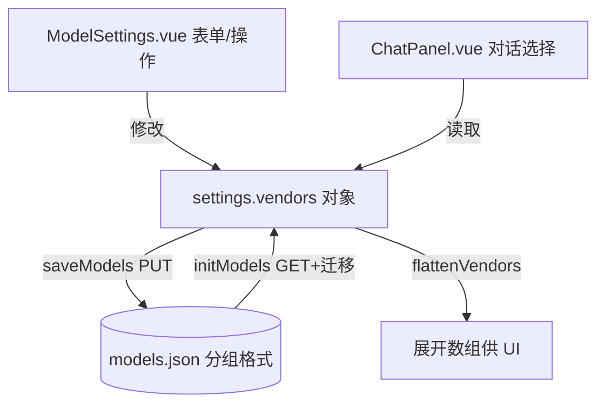

## 产品概述

将模型配置（models.json）的存储格式从扁平数组结构重构为按"供应商"分组的标准格式，与用户给出的示例保持一致：顶层为 `{ activeModel, [vendorKey]: { name, npm, options:{apiKey,baseURL}, models:{ [modelId]: { name, options:{temperature, thinking?}, modalities? } } } }`。各模型单独保存 temperature，activeModel 以组合键 `vendorKey/modelId` 置于顶层。npm 字段语义为 baseURL 平台类型（openai→@ai-sdk/openai，anthropic→@ai-sdk/anthropic）。旧扁平数据自动迁移，不丢失配置。

## 核心特性

- models.json 改为按供应商分组的对象映射格式（与用户示例一致）
- 每个模型在自身 options 中保存独立 temperature（去除全局 temperature）
- activeModel 以 `vendorKey/modelId` 组合键存于顶层
- npm 字段按 platform 映射序列化（openai→@ai-sdk/openai，anthropic→@ai-sdk/anthropic）
- 旧扁平格式（models 数组）读取时自动迁移为分组格式
- ModelSettings.vue / ChatPanel.vue 读写逻辑同步重构并兼容

## 技术栈

- 前端：Vue 3（`<script setup>` Composition API）+ Ant Design Vue，沿用现有项目结构
- 存储：后端 `GET/PUT /api/settings/models` 已为通用 JSON 读写，无需改动 `server/index.js`
- 状态：src/settings.js 中 `reactive` 对象 + fetch 异步读写

## 实现方案

采用"磁盘格式与内存格式分离"策略：磁盘写按供应商分组的标准 JSON（`{ activeModel, [vendorKey]: {...} }`），内存 `reactive(settings)` 额外保留 UI 态数组字段 `configuredVendors/disabledVendors/customVendors`，落盘时仅序列化 `vendors + activeModel`。提供互转 helper 兼容旧扁平数组数据。

### 关键技术决策

1. **顶层直接是 vendorKey 映射**（不套 `vendors` 包裹），与用户示例完全一致，降低认知负担。
2. **activeModel 组合键**：`${vendorKey}/${modelId}`，解析时 split('/') 取前后段，避免全局唯一 id 冲突。
3. **npm = platform 映射**：保存时 `platform==='openai'→'@ai-sdk/openai'`、`'anthropic'→'@ai-sdk/anthropic'`、`'native'→''`；读取时反向映射回填 form.platform。
4. **temperature 下沉到模型**：`model.options.temperature`，移除全局 `settings.temperature`；ChatPanel 取 `modelObj.options?.temperature ?? 0.3` 兜底。
5. **旧数据迁移**：`initModels` 检测 `data.models` 为数组则按 `vendorKey` 归类，baseURL/apiKey 优先取模型级，否则取全局 `data.baseUrl/data.apiKey`，temperature 取 `data.temperature` 写入各模型 options。

## 实现说明

- 避免重复遍历：提供 `flattenVendors()` computed/helper 将分组结构展开为 `[{id, name, vendorKey, baseUrl, apiKey, temperature, modalities}]`，供 ChatPanel 的 groupedModels 与 ModelSettings 的 modelsOfVendor 复用，避免多处重复 reduce。
- 保存时 `saveModels()` 用 `pick(settings, ['vendors','activeModel'])` 替代旧 MODEL_KEYS，防止把 UI 态数组写入磁盘。
- 日志沿用 `console.error` 兜底，不打印敏感 apiKey 原文。
- 向后兼容：旧 localStorage 已废弃，仅处理旧 models.json 数组格式迁移。

## 架构设计



## 目录结构

```
src/
├── settings.js                  # [MODIFY] 重构 defaults 为 vendors 对象；新增 platform<->npm 映射、flattenVendors、buildModels/parseDisk；initModels 兼容迁移；saveModels 仅序列化 vendors+activeModel
├── components/
│   ├── ModelSettings.vue        # [MODIFY] 所有 settings.models 数组操作改为 settings.vendors[vk].models 对象；form.platform<->npm 映射；modelRows 增加 temperature；disabledVendors/configuredVendors/customVendors 保持以 vendorKey 关联
│   └── ChatPanel.vue            # [MODIFY] groupedModels 从 vendors 派生；temperature 取 model.options.temperature；baseUrl/apiKey 取 vendor.options；activeModel 组合键解析
server/
└── index.js                     # [不变] GET/PUT /api/settings/models 通用读写
```

## 关键结构

```javascript
// 磁盘 models.json 格式
{
  "activeModel": "bailian-coding-plan/qwen3-coder-plus",
  "bailian-coding-plan": {
    "name": "阿里云百炼",
    "npm": "@ai-sdk/anthropic",
    "options": { "apiKey": "sk-...", "baseURL": "https://..." },
    "models": {
      "qwen3-coder-plus": { "name": "Qwen3 Coder Plus", "options": { "temperature": 0.3 } },
      "kimi-k2.5": { "name": "Kimi K2.5", "modalities": {"input":["text","image"],"output":["text"]}, "options": {"temperature":0.3,"thinking":{"budgetTokens":1024,"type":"enabled"}} }
    }
  }
}

// 内存 reactive settings 附加字段
// configuredVendors: string[], disabledVendors: string[], customVendors: [{key,name,website,baseUrl}]
```

## Agent Extensions

### Skill

- **vue-best-practices**
- Purpose: 指导 ModelSettings.vue / ChatPanel.vue 的 Composition API 与 `<script setup>` 重构写法，确保符合 Vue 3 最佳实践
- Expected outcome: 组件重构代码风格统一、无响应式陷阱、lint 0 错误
- **eslint-checker**
- Purpose: 在改造完成后运行 ESLint 静态检查，自动修复风格/质量问题
- Expected outcome: 所有改动文件 lint 0 错误，符合项目既有规范