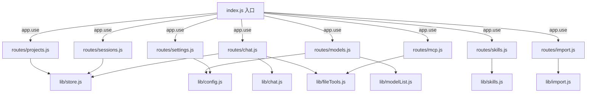

## 用户需求

将 `server/index.js`（约 1310 行单体文件）按 API 职责拆分为多文件结构，提升可维护性。

## 产品概述

后端服务代码重构：在不改变任何对外 HTTP 接口、请求/响应格式与业务逻辑的前提下，将单文件拆分为 `server/routes/`（各 API 路由模块）与 `server/lib/`（共享工具与状态），`server/index.js` 仅保留入口装配与 `app.listen`。

## 核心特性

- 拆出项目路由（projects、locate-dir）、会话路由（sessions）、配置路由（settings/models/mcp）、对话路由（chat）、模型路由（models 预设与 fetch）、MCP 测试路由、技能路由（skills）、导入路由（import 系列）
- 抽取共享单例：projects/sessions 存储 Map、配置目录与读写函数、文件工具、对话相关常量与消息转换、模型列表规则、技能/导入共享逻辑
- 所有 `/api/*` 路径与响应格式保持完全兼容，前端零改动

## 技术栈

- 后端：Node.js + Express（ES Module，保持与现有 `index.js` 一致的 `import` 风格）
- 文件组织：Express Router 模式，`server/index.js` 作为装配入口

## 实现方案

采用 Express Router 按职责拆分。每个 `server/routes/*.js` 导出 `express.Router()`，路由内部使用相对路径（如 `router.get('/projects', ...)`），由 `index.js` 以 `app.use(router)` 挂载，保持 `/api/...` 前缀不变。

**关键决策**：

1. **共享状态单例化**：将 `projects` Map、`sessions` Map 及其 load/save 函数抽到 `lib/store.js` 作为模块级单例导出，所有路由引用同一实例。解决 projects 删除级联会话（`index.js` 第 83-99 行依赖 `sessions`/`saveSessions`）的跨模块依赖。
2. **共享工具/常量分文件**：`lib/config.js`（路径常量 + readConfigFile/writeConfigFile + DASHSCOPE 常量 + SETTINGS_DIR）、`lib/fileTools.js`（safeResolve/tree/grep/buildTools）、`lib/chat.js`（SYSTEM_PROMPT/buildChatModel/runAgent/toLangchainMessage/TokenStatsHandler）、`lib/modelList.js`（MODEL_LIST_TYPE/PRESET_VENDOR_LIST_RULES）、`lib/skills.js`（候选目录/解析/扫描）、`lib/import.js`（导入源归一化/扫描/软链工具）。
3. **入口精简**：`index.js` 仅负责 express 实例创建、中间件、`dotenv`、加载各 store、挂载 router、`app.listen`。

**性能与可靠性**：拆分仅改变文件布局，不引入新依赖、不改变运行时行为；Map 单例在进程内共享，无额外 IO 或序列化开销。风险点在于跨模块引用路径，需通过相对 import 与统一 store 导出规避循环依赖（store 不依赖 routes，routes 依赖 store）。

## 实现注意

- 严格保持现有响应结构与错误码（400/404/500 等），禁止改写业务逻辑。
- `importPathOverrides` 及其持久化属于 import 模块内部状态，保留在 `lib/import.js`，由 import 路由共享。
- 注意 `lib/store.js` 不能 import 任何 routes 文件，避免循环引用；routes 单向依赖 lib。
- `package.json` 的 server 启动脚本保持指向 `server/index.js`，无需改动。

## 架构设计



## 目录结构

```
server/
├── index.js              # [MODIFY] 入口：express 实例、中间件、dotenv、加载 store、挂载各 router、app.listen
├── lib/
│   ├── store.js          # [NEW] projects/sessions Map 单例 + load/save + 级联删除辅助
│   ├── config.js         # [NEW] SETTINGS_DIR、各配置文件路径、readConfigFile/writeConfigFile、DASHSCOPE_BASE/API_KEY/DEFAULT_MODEL
│   ├── fileTools.js      # [NEW] safeResolve/tree/grep/buildTools（文件工具与 LangChain 工具构造）
│   ├── chat.js           # [NEW] SYSTEM_PROMPT、buildChatModel、runAgent、toLangchainMessage、TokenStatsHandler、writeMeta 辅助
│   ├── modelList.js      # [NEW] MODEL_LIST_TYPE、PRESET_VENDOR_LIST_RULES 常量与解析规则
│   ├── skills.js         # [NEW] getCandidateSkillDirs、parseSkillFrontmatter、scanSkills
│   └── import.js         # [NEW] IMPORT_SOURCE_DEFAULTS、importPathOverrides 持久化、getEffectiveSource、normalizeMcpEntry、collectMcpServersFor、scanImportableSkillsFor、listImportSourceDefs、copyDirRecursive、createLink
└── routes/
    ├── projects.js       # [NEW] /api/projects (GET/POST/DELETE)、/api/locate-dir
    ├── sessions.js       # [NEW] /api/sessions (GET/POST/PUT/DELETE)；级联删除委托 store
    ├── settings.js       # [NEW] /api/settings/models、/api/settings/mcp、/api/settings (GET/PUT)
    ├── chat.js           # [NEW] /api/chat 流式对话路由
    ├── models.js         # [NEW] /api/models 预设、/api/models/fetch
    ├── mcp.js            # [NEW] /api/mcp/test
    ├── skills.js         # [NEW] /api/skills
    └── import.js         # [NEW] /api/import/sources、/api/import/path、/api/import/scan、/api/import/skills
```

## 关键代码结构

```js
// lib/store.js 核心导出（模块级单例，被 routes 共享）
export const projects = new Map()
export const sessions = new Map()
export function loadProjects(): void
export function saveProjects(): void
export function loadSessions(): void
export function saveSessions(): void
// 级联删除某项目下所有会话（供 projects 路由删除时调用）
export function deleteSessionsByProject(projectId: string): void
```

```js
// routes/*.js 统一形态
import { Router } from 'express'
const router = Router()
router.get('/projects', ...)
export default router
```