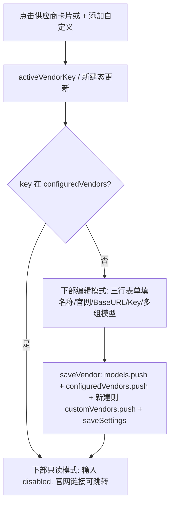

## 产品概述

重构模型设置页为上下两大区块：顶部「添加供应商」卡片列表，下部「供应商配置」统一表单。预设供应商与自定义供应商走同一套可编辑配置；保存后该供应商进入只读模式，官网链接可点击跳转。支持连续添加多个模型、设置主要模型。

## 核心功能

- 顶部卡片列表：展示预设供应商（自定义配置、阿里云百炼编程、百炼通义、DeepSeek、智谱 GLM、腾讯混元）与用户自定义供应商；未配置显示「+ 配置」，已配置显示「已配置 ✓」；点击选中高亮并切换下部表单；末尾「+ 添加自定义供应商」入口。
- 下部统一配置表单（三行结构）：
- 第一行：供应商名称（必填）+ 供应商官网（选填，仅展示）。
- 第二行：Base URL + API Key（含显示/隐藏、可勾选使用默认 Key）。
- 第三行及以后：模型名称 + 模型 ID，可连续添加多组，每组可删除。
- 只读模式：供应商保存后，下方所有字段 disabled 只读展示，官网渲染为可点击链接（target=_blank）；未填官网则不显示链接。
- 已配置判定：按供应商 key 记录到 settings.configuredVendors，每次保存推入。
- 添加自定义供应商：名称必填、官网选填、Base URL、API Key、模型（多组）；保存后进入顶部卡片列表并标记已配置。
- 主要模型：在「已添加模型」列表点「使用」设置，复用 settings.activeModel。
- 保留：已添加模型列表、删除、温度设置、整体保存与恢复默认。

## 技术栈

- 前端：Vue 3 + Vite + `<script setup>` Composition API（沿用现有项目）
- 状态：src/settings.js 导出 reactive 全局 settings 对象（localStorage 持久化）
- 样式：组件内 scoped CSS（沿用现有风格，不引入新 UI 库）

## 实现方案

### 数据模型扩展

- `src/settings.js` 的 `defaults` 增加 `configuredVendors: []`（已配置供应商 key 集合）与 `customVendors: []`（用户自定义供应商：`{key,name,website,baseUrl}`）。
- `load()` 对两字段做数组兜底；`resetSettings()` 复位两者。模型对象结构 `{id,name,baseUrl,apiKey}` 不变。

### 组件重构（SettingsPanel.vue）

- 数据源合并：`allVendors = computed(() => [...VENDORS, ...settings.customVendors.map(v => ({...v, isCustomVendor:true}))])`。
- 顶部卡片列表：`v-for="v in allVendors"` 渲染 `.vendor-card`，显示名称 + 状态徽标（`settings.configuredVendors.includes(v.key)`）；点击设置 `activeVendorKey`；末尾「+ 添加自定义供应商」卡片，点击进入新建态（activeVendorKey 置空并用 newCustom 标记）。
- 下部 config-card 统一三行表单：
- 编辑态：
    - 第一行 `.add-form__row`：名称 input（必填）+ 官网 input（选填）
    - 第二行 `.add-form__row`：Base URL input + API Key input（含显示/隐藏按钮，可勾选使用默认 Key）
    - 第三行起：`v-for="(row,i) in modelRows"` 每行 模型名称 + 模型 ID + 删除按钮；底部「+ 添加模型行」可追加多组
- 只读态（key 在 configuredVendors）：所有 input `disabled`；官网渲染 `<a :href="website" target="_blank" rel="noopener">`；模型以只读列表展示。
- 保存（预设/自定义共用 `saveVendor()`）：校验名称非空、modelRows 至少一组且 name/id 非空且不重复 → 将各组 push 到 `settings.models`（带 baseUrl/apiKey）→ 当前供应商 key 去重推 `settings.configuredVendors` → 若是新建自定义先 push `settings.customVendors`（key=slug+时间戳）→ `saveSettings()` → 进入只读态并显示成功提示。
- 主要模型复用 `settings.activeModel`，已添加列表「使用」按钮即设置。

### 关键决策

- 已配置按「供应商 key 集合」判定，逻辑简单无歧义，符合用户确认。
- 自定义供应商官网仅展示 + 只读可点击跳转，不参与请求；请求仍用 baseUrl+apiKey+modelId。
- 卡片列表替代标签；下部表单编辑/只读双态复用，避免重复代码。
- 模型行用本地 `modelRows` 数组管理，保存时一次性写入 settings.models，支持多组与单行删除。
- 不改动后端 server、ChatPanel、App.vue，控制改动面。

### 性能与可靠性

- 纯前端响应式更新，无网络开销；computed 派生避免冗余渲染。
- 保存即时写 localStorage，刷新不丢；reset 清空 configuredVendors 与 customVendors。
- 名称非空、模型 id 重复/非空校验防止脏数据。

## 实现注意事项

- 沿用现有 `.card / .field / .add-form__row / .btn` 样式，新增 `.vendor-card` 系列与 `.readonly-hint` 保持视觉一致。
- 不改动其他模块。
- 执行后提醒用户 `Ctrl+F5` 强刷并确认 dev server 运行。

## 架构设计

数据流向：



## 目录结构

```
src/
├── settings.js                  # [MODIFY] defaults 增加 configuredVendors/customVendors；load/reset 兼容
└── components/
    └── SettingsPanel.vue        # [MODIFY] 顶部卡片列表+自定义入口；下部三行编辑/只读双态表单；saveVendor 记录 key；样式新增
```

## 关键代码结构

```js
// settings.js defaults 片段
const defaults = {
  baseUrl: 'https://dashscope.aliyuncs.com/compatible-mode/v1',
  apiKey: '',
  models: [{ id: 'qwen-coder-plus', name: 'Qwen Coder Plus' }],
  activeModel: 'qwen-coder-plus',
  temperature: 0.3,
  configuredVendors: [], // 新增：已配置供应商 key 集合
  customVendors: [],     // 新增：用户自定义供应商 { key, name, website, baseUrl }
}
```

采用简洁明亮的企业级卡片式布局。页面分上下两大区块：顶部为供应商卡片网格（未配置显示「+ 配置」幽灵按钮风格，已配置显示蓝色「已配置 ✓」徽标，含末尾「+ 添加自定义供应商」卡）；下部为白色圆角配置卡片，按三行结构排列——第一行名称+官网、第二行 Base URL+API Key、第三行起模型名称+模型 ID（可多组）。只读模式下输入框置灰展示，官网为蓝色可点击链接。整体留白充足、层次清晰、交互反馈明确。

## Agent Extensions

### Skill

- **vue-best-practices**
- Purpose: 确保 SettingsPanel.vue 与 settings.js 的 Vue 3 Composition API、`<script setup>`、reactive 用法符合最佳实践
- Expected outcome: 组件与状态管理实现遵循 Vue 3 标准模式，无反模式
- **eslint-checker**
- Purpose: 执行 ESLint 检查 SettingsPanel.vue 与 settings.js 的代码质量与风格
- Expected outcome: 无 lint error，代码符合项目静态规范