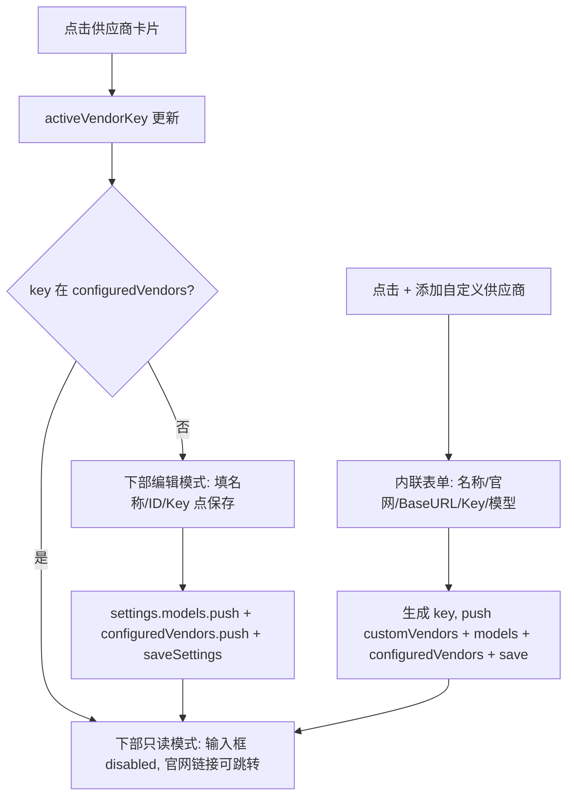

## 产品概述

重构模型设置页为上下两大区块：顶部「添加供应商」卡片列表，下部「供应商配置」表单。新增「添加自定义供应商」能力，支持自建供应商并连续添加多个模型，可设置「主要模型」。供应商保存后进入只读模式，官网链接可点击跳转。

## 核心功能

- 顶部区块：卡片网格展示所有供应商（预设 + 用户自定义）。预设含自定义配置、阿里云百炼编程、百炼通义、DeepSeek、智谱 GLM、腾讯混元；用户可新增自定义供应商并并列展示。未配置卡片显示「+ 配置」，已配置显示「已配置 ✓」徽标；点击卡片选中高亮并切换下部表单。
- 下部区块：选中供应商后展示配置表单，含基础 URL、API 密钥（显示/隐藏、可勾选使用默认 Key）、模型名称、模型 ID；同一供应商可连续添加多个模型，保存后保留 Base URL 与 Key，仅清空名称/ID。
- 添加自定义供应商表单：供应商名称（必填）、供应商官网（选填，仅展示）、基础 URL（必要）、API 密钥、模型名称/模型 ID（连续添加）；保存后进入顶部卡片列表并标记已配置，模型进入已添加列表。
- 已配置判定：按供应商 key 记录到 settings.configuredVendors，每次保存推入。
- 只读模式：供应商保存后，下方配置模块变为只读展示（输入框 disabled），并显示可点击的「官网」链接（target=_blank 跳转），官网仅展示不参与请求。
- 主要模型：用户在已添加模型列表点「使用」设置主要模型，复用现有 settings.activeModel（对话页底部切换与发消息使用）。
- 保留：已添加模型列表、删除、温度设置、整体保存与恢复默认。

## 技术栈

- 前端：Vue 3 + Vite + `<script setup>` Composition API（沿用现有项目）
- 状态：src/settings.js 导出 reactive 全局 settings 对象（localStorage 持久化）
- 样式：组件内 scoped CSS（沿用现有风格，不引入新 UI 库）

## 实现方案

### 数据模型扩展

- `src/settings.js` 的 `defaults` 增加 `configuredVendors: []`（已配置供应商 key 集合）与 `customVendors: []`（用户自定义供应商：`{key,name,website,baseUrl}`）。
- `load()` 对两字段做数组兜底；`resetSettings()` 复位两者。模型对象结构 `{id,name,baseUrl,apiKey}` 不变。

### 组件重构（SettingsPanel.vue）

- 数据源合并：`allVendors = computed(() => [...VENDORS, ...settings.customVendors.map(v => ({...v, isCustomVendor:true}))])`。
- 顶部卡片列表：`v-for="v in allVendors"` 渲染 `.vendor-card`，显示名称 + 状态徽标（`settings.configuredVendors.includes(v.key)`）；点击设置 `activeVendorKey`；末尾「+ 添加自定义供应商」卡片打开内联表单。
- 下部表单：
- 若当前供应商 key 已在 configuredVendors → 只读模式：所有输入 disabled，模型名称/ID/Key 仅展示；显示「官网」链接 `<a :href="activeVendor.website" target="_blank" rel="noopener">`，自定义供应商未填官网则不显示。
- 否则编辑模式：基础 URL 自动带出（可改）、模型名称/ID 连续添加、API Key 可勾默认。
- `addModel()`：push 模型后把 `activeVendor.value.key` 去重推入 `settings.configuredVendors` 并 `saveSettings()`；保留 Base URL，清空名称/ID，显示成功提示，进入只读。
- 自定义供应商保存：校验名称非空 → 生成 key（基于名称 slug + 时间戳）→ push `settings.customVendors` → 填写模型 push `settings.models` → key 推 `settings.configuredVendors` → `saveSettings()` → 进入只读。
- 主要模型复用 `settings.activeModel`，已添加列表「使用」按钮即设置。

### 关键决策

- 已配置按「供应商 key 集合」判定，逻辑简单无歧义，符合用户确认。
- 自定义供应商官网仅展示 + 只读可点击跳转，不参与请求；请求仍用 baseUrl+apiKey+modelId。
- 卡片列表替代标签，满足视觉诉求；下部表单复用避免重复代码。
- 不改动后端 server、ChatPanel、App.vue，控制改动面。

### 性能与可靠性

- 纯前端响应式更新，无网络开销；computed 派生避免冗余渲染。
- 保存即时写 localStorage，刷新不丢；reset 清空 configuredVendors 与 customVendors。
- 模型 id、供应商名称重复/非空校验防止脏数据。

## 实现注意事项

- 沿用现有 `.card / .field / .add-form__row / .btn` 样式，新增 `.vendor-card` 系列与 `.custom-vendor-form / .readonly-hint` 保持视觉一致。
- 不改动其他模块。
- 执行后提醒用户 `Ctrl+F5` 强刷并确认 dev server 运行。

## 架构设计

数据流向：



## 目录结构

```
src/
├── settings.js                  # [MODIFY] defaults 增加 configuredVendors/customVendors；load/reset 兼容
└── components/
    └── SettingsPanel.vue        # [MODIFY] 顶部卡片列表+自定义供应商入口；下部编辑/只读双态表单；addModel 记录 key；样式新增
```

## 关键代码结构

```js
// settings.js defaults 片段
const defaults = {
  baseUrl: 'https://dashscope.aliyuncs.com/compatible-mode/v1',
  apiKey: '',
  models: [{ id: 'qwen-coder-plus', name: 'Qwen Coder Plus' }],
  activeModel: 'qwen-coder-plus',
  temperature: 0.3,
  configuredVendors: [], // 新增：已配置供应商 key 集合
  customVendors: [],     // 新增：用户自定义供应商 { key, name, website, baseUrl }
}
```

## 设计风格

采用简洁明亮的企业级卡片式布局。页面分为上下两大区块：顶部为供应商卡片网格（未配置显示「+ 配置」幽灵按钮风格，已配置显示蓝色「已配置 ✓」徽标，含末尾「+ 添加自定义供应商」卡）；下部为白色圆角配置卡片，含基础 URL、API 密钥（显示/隐藏）、模型名称、模型 ID 输入框与保存按钮。新增自定义供应商以内联表单呈现。只读模式下输入框置灰展示，官网为蓝色可点击链接。整体留白充足、层次清晰、交互反馈明确。卡片 hover 轻微上浮/边框变色，选中卡片蓝色边框，保存后绿色成功提示 2 秒消失、顶部徽标即时点亮。

## 页面区块

- 顶部「添加供应商」：卡片网格（自适应列数），每张卡显示供应商名 + 状态标记，点击选中高亮蓝色边框；末尾「+ 添加自定义供应商」卡片。
- 下部「供应商配置」：标题显示当前供应商；编辑模式字段纵向排列，API 密钥行含显示/隐藏按钮；底部保存按钮 + 成功提示。只读模式字段 disabled 置灰，展示可点击官网链接与只读提示。
- 已添加模型：列表卡片，含使用/删除操作。
- 温度与全局保存：底部卡片。

## 交互

- 卡片 hover 轻微上浮/边框变色；选中卡片蓝色边框。
- 保存后绿色成功提示 2 秒自动消失；顶部徽标即时点亮。
- 只读模式官网链接 hover 变色、新标签页打开。

## Agent Extensions

### Skill

- **vue-best-practices**
- Purpose: 确保 SettingsPanel.vue 与 settings.js 的 Vue 3 Composition API、`<script setup>`、reactive 用法符合最佳实践
- Expected outcome: 组件与状态管理实现遵循 Vue 3 标准模式，无反模式
- **eslint-checker**
- Purpose: 执行 ESLint 检查 SettingsPanel.vue 与 settings.js 的代码质量与风格
- Expected outcome: 无 lint error，代码符合项目静态规范