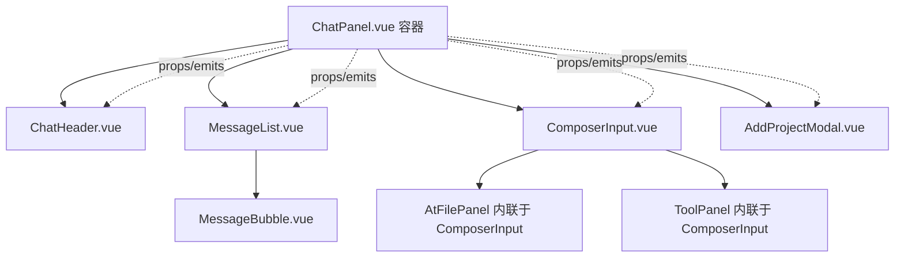

## 用户需求

ChatPanel.vue 代码过长（约 2068 行，单文件承载聊天对话框全部逻辑与样式），需按功能拆分组件，降低单文件复杂度、提升可维护性。

## 产品概述

将现有 ChatPanel.vue 拆分为多个职责单一的子组件，由 ChatPanel.vue 作为容器组件持有状态并通过 props/emits 编排；所有交互行为、样式、API 调用、触发逻辑严格保持不变。

## 核心特性

- 将「聊天气泡框内容」（消息渲染：气泡、思考区、工具调用时间线、缩略图）整体抽离为 `MessageList.vue` / `MessageBubble.vue` 组件。
- 将「聊天对话框输入区内容」（`contenteditable` composer 输入框、@ 文件面板、/ 工具面板、底部发送栏）整体抽离为 `ComposerInput.vue`。
- 将「顶部栏」（标题/重命名/项目下拉/清空历史/日志按钮/会话切换）抽离为 `ChatHeader.vue`。
- 将「添加项目弹窗」抽离为 `AddProjectModal.vue`。
- 通信采用纯 props/emits：ChatPanel 为容器持有状态，子组件仅接收 props 与 emit 事件。
- 拆分后各组件自带 `<style scoped lang="less">`，less 变量由 vite 全局注入无需额外 import。
- 严格零行为变化：仅调整文件结构，用 Chrome MCP 做端到端回归验证。

## 技术栈选择

- 框架：Vue 3 + `<script setup>` Composition API（与现有项目一致）
- 样式：`<style scoped lang="less">`，`@color-*` 变量由 `vite.config.js` 的 `less.preprocessorOptions.additionalData` 全局注入，子组件无需 import
- 通信：纯 props / emits（用户明确选择，保守、低风险）
- 组件库：沿用 `ant-design-vue`（a-select、a-button 已使用）

## 实现方案

按用户澄清的边界做两类拆分：

1. **消息展示块**：`MessageList.vue`（v-for 渲染 `currentMessages`） + `MessageBubble.vue`（单条消息：user/ai 气泡、思考区、工具时间线、缩略图）。当前消息渲染逻辑全部集中在模板 953-1030 行与脚本中 `renderMarkdown/prettyArgs/clip/resultExpanded/toggleResult/expandedThinking` 等辅助，原样搬入子组件，通过 props 接收 `messages`、emit 无状态变更事件（`toggleResult` 用 reactive Set 仍可在子组件内保留，因它仅控制本地展开 UI 状态；若需严格由父持有，则 emit 事件由父维护 Set——为最小改动，将 `resultExpanded` reactive Set 与 `expandedThinking` 留在子组件内部即可，不影响对外行为）。
2. **输入区块**：`ComposerInput.vue` 封装 `composerEl`、`.chat__input-composer`、`@` 面板（openAtPanel/loadAtDir/chooseAtFile/onAtKeydown 等）、`/` 面板（chooseCmd/onCmdKeydown/filteredCmdItems 等）、底部发送栏。它依赖大量与发送耦合的状态（`composerTokens`、`sessionToolCmds`、`selectedSkills`、`selectedMcp`、`triggerRange`、composer DOM 操作），故通过 `v-model` 或 props+emit 把「最终要发送的内容 token / 选中的工具集合」回传给容器；`@keydown.enter` 的 send 仍由容器在 `ComposerInput` 上监听或在子组件 emit `send` 事件后由容器处理。为严格零行为变化，推荐：子组件内部保留 composer 全部 DOM 逻辑，对外 emit `send`、emit `update:tokens`（含 composerTokens、sessionToolCmds、selectedSkills、selectedMcp 快照）供父 `send()` 使用；容器把 `send()` 改为消费子组件回传的快照。
3. **顶部栏**：`ChatHeader.vue` 接收 `activeSession`、`active`、模型分组等 props，emit `rename`/`newChat`/`switchProject`/`openLog`/`clearHistory` 等事件，容器保留对应函数。
4. **添加项目弹窗**：`AddProjectModal.vue` 接收 `show`、`dirPickerSupported` 等 props，emit `confirm`/`cancel`/`pick`；`pickDirectory`/`onPathInput`/`confirmAdd` 逻辑搬入子组件，容器只响应 emit 结果。

## 实现要点

- 容器 ChatPanel.vue 继续 import `projects.js`/`sessions.js`/`settings.js` 等 store，持有 `activeProjectId`/`sessions`/`settings` 等响应式源；子组件只接收计算后的值与 emit 意图。
- `composerEl` ref 在子组件内，容器不再直接操作 DOM；若容器 `send()` 需要清空 composer，则通过子组件暴露 `clear()` 方法（defineExpose）或 emit `cleared` 后子组件自行清空——推荐子组件在 emit `send` 前自行清空 composer DOM 并同步 tokens，父仅做网络请求。
- 所有 `:deep()` 样式（如 `.bubble__content :deep(pre)`、`:deep(.composer-tag__label)`）随所属模板一起迁移到对应子组件的 scoped 样式中，保持生效。
- 严格保留 `contenteditable` 的 `data-placeholder`、触发符检测、原位插入 Range 逻辑，不重构算法。
- 不引入 Pinia / composables（用户明确排除）。

## 性能与回归

- 拆分为纯展示/交互子组件不影响运行时性能；scoped 样式按需编译。
- 用 Chrome MCP 回归：@ 触发文件面板、/ 触发工具面板、多选并存、原位插入对齐、发送后消息渲染（思考区/工具时间线/气泡）、添加项目弹窗只读路径、标题重命名。对比拆分前后 DOM 结构与可见行为一致。

## 架构设计



## 目录结构

```
src/components/chat/
├── ChatHeader.vue        # [NEW] 顶部栏：标题/重命名/项目下拉/清空历史/日志/会话切换。props 收 activeSession/active/groupedModels 等，emit rename/newChat/switchProject/openLog/clearHistory
├── MessageList.vue       # [NEW] 消息列表容器，v-for currentMessages，包 scrollEl 滚动逻辑。props 收 messages，内含 expandedThinking/resultExpanded 本地 UI 状态
├── MessageBubble.vue     # [NEW] 单条消息：user/ai 气泡、思考区、工具调用时间线、缩略图。props 收 message/index，使用 renderMarkdown/prettyArgs/clip
├── ComposerInput.vue     # [NEW] 输入区：composerEl + @面板 + /面板 + 底部发送栏。保留全部 DOM/触发逻辑，emit send、update:tokens。defineExpose clear()
└── AddProjectModal.vue   # [NEW] 添加项目弹窗。props 收 show/dirPickerSupported，emit confirm/cancel/pick，内含 pickDirectory/onPathInput/confirmAdd
src/components/ChatPanel.vue  # [MODIFY] 仅保留容器编排：import 子组件、持有 store 状态、定义事件处理函数、模板改为组合子组件
```

## 关键代码结构（接口契约）

```ts
// ComposerInput.vue
defineProps<{
  effort: string
  permission: string
  groupedModels: any[]
  activeModel: string
  active: any
  canSend: boolean
}>()
const emit = defineEmits<{
  (e: 'send', payload: {
    tokens: Token[],
    sessionToolCmds: string[],
    selectedSkills: string[],
    selectedMcp: string[],
  }): void
  (e: 'update:effort', v: string): void
  (e: 'update:permission', v: string): void
  (e: 'update:activeModel', v: string): void
}>()
defineExpose<{ clear: () => void }>()

// AddProjectModal.vue
defineProps<{ show: boolean; dirPickerSupported: boolean; dirPickerHint: string }>()
const emit = defineEmits<{
  (e: 'confirm', form: { alias: string; path: string }): void
  (e: 'cancel'): void
  (e: 'update:show', v: boolean): void
}>()
```

## Agent Extensions

### MCP

- **chrome-devtools**
- Purpose: 拆分完成后做端到端回归验证，确认 @ 文件面板、/ 工具面板、原位插入对齐、发送后消息渲染、添加项目弹窗只读路径、标题重命名等行为与拆分前完全一致。
- Expected outcome: 通过 evaluate_script / take_snapshot / take_screenshot 验证 DOM 结构与可见交互无回归，输出验证结论。