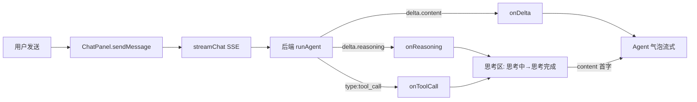

## 用户需求

重新设计对话框的视觉与交互效果，覆盖以下四种状态与元素：

- 用户气泡（右侧、主色填充）
- Agent 气泡（左侧、浅色卡片、Markdown 渲染）
- 思考中（收到首条推理文本时显示「思考中…」三点动画 + 流式推理内容）
- 思考完成（推理结束后显示「✓ 思考完成」，并收起为可展开摘要）

## 产品概述

把当前纯文本流的对话升级为带状态感知的聊天界面：后端在模型支持推理（reasoning）时推送结构化事件，前端据此渲染思考时间线（含工具调用步骤），完成后折叠为摘要，再切换到 Agent 正式回复气泡。普通无推理模型的回复保持原有气泡样式，向后兼容。

## 核心特性

- 后端开启模型 thinking 并推送 `reasoning` 增量与 `tool_call` 结构化事件（不再把工具调用混入正文）。
- 前端 SSE 解析新增 `onReasoning` / `onToolCall` 回调。
- 思考区：三点动画 + 流式推理文本，工具调用作为时间线条目并入思考区，结束后整体收起为「已调用 N 个工具」摘要，可点击展开。
- 用户气泡与 Agent 气泡采用全新视觉（圆角、阴影、主色区分），使用已配置的全局 less 变量与设计语言统一风格。
- 思考中/思考完成/工具步骤均提供无障碍标签与 reduced-motion 兼容。

## 技术栈

- 前端：Vue 3（`<script setup>`）+ Vite + Ant Design Vue + less（已全局注入 `src/assets/variables.less`）
- 后端：Node.js + Express + LangChain（`@langchain/openai`）+ DashScope 兼容模式 SSE
- 数据流：Express SSE（`data: {...}\n\n`）→ 前端 fetch ReadableStream 逐行解析

## 实现方案

### 总体策略

打通「真实 reasoning 数据」链路：后端在 `buildChatModel` 开启 `enable_thinking`（DashScope 兼容 OpenAI 接口，透传 `modelKwargs.enable_thinking=true`），在 `runAgent` 流式循环中读取 `chunk.additional_kwargs.reasoning_content` 并推送 `choices[0].delta.reasoning`；工具调用改为结构化事件 `{type:'tool_call', name, args, status:'start'|'end', result}`。前端 `streamChat` 解析后将 reasoning 增量交给 `onReasoning`，tool_call 交给 `onToolCall`，ChatPanel 据此驱动思考区与气泡状态。

### 关键技术决策

1. **开启 thinking**：`ChatOpenAI` 构造时通过额外参数传递 DashScope 的 `enable_thinking`。LangChain 的 `ChatOpenAI` 支持透传未知字段到请求体（OpenAI 兼容模式下会原样发出），使用 `modelKwargs: { enable_thinking: true }`（若版本不支持则改用 `lc_kwargs` 或构造后 patch）。仅在 `effort` 为高或模型为 qwen-thinking 系列时开启，避免不支持的模型报错。
2. **reasoning 字段映射**：DashScope 开启 thinking 后，流式 chunk 的推理文本位于 `chunk.additional_kwargs.reasoning_content`（LangChain 透传）。在 `runAgent` 循环中对每个 chunk 同时读取 `content` 与 `reasoning_content`，分别推送。
3. **工具调用结构化**：移除 `res.write(... '🔧 调用 ...')` 文本注入（第 96 行），改为 `status:'start'` 推送 `{type:'tool_call', name, args}`，工具执行完再推送 `{type:'tool_call', id, status:'end', result}`，前端维护时间线条目。
4. **向后兼容**：前端在无 reasoning 事件时（普通模型），直接进入 Agent 气泡流式渲染，思考区不显示。

### 性能与可靠性

- SSE 逐块写入，reasoning 与 content 均为增量，不缓存整段后再渲染，避免首字延迟（TTFB 与现有一致）。
- 思考区仅渲染最近一条 assistant 消息的状态，不遍历全部历史；工具时间线条目在流式过程中 push，渲染用 `:key` 稳定。
- 落盘时仅持久化 `content` 与 `toolCalls` 摘要，reasoning 文本可选择性持久化（建议保留以展示历史思考）。

## 实现要点（执行细节）

- **server/lib/chat.js**
- `buildChatModel`：新增 `enableThinking` 形参，开启时透传 `enable_thinking`（注意 DashScope 要求 `enable_thinking` 与 `stream_options` 配合，并可能返回 `reasoning_content`）。
- `runAgent`：流式循环内读取 `chunk.additional_kwargs?.reasoning_content`，有值则 `res.write(delta.reasoning)`；工具调用改为 `tool_call` 事件（start/end 两段），执行结果截断后随 end 推送。
- **server/routes/chat.js**
- 将 `effort==='high'` 或模型名包含 `thinking` 时 `enableThinking=true` 传给 `buildChatModel`；无项目分支（`chatModel.stream`）同样读取 reasoning。
- **src/api/agent.js**
- `streamChat` SSE 解析增加：`json.choices?.[0]?.delta?.reasoning` → `onReasoning?.(text)`；`json.type==='tool_call'` → `onToolCall?.(payload)`；兼容旧 `delta.content`。
- **src/components/ChatPanel.vue**
- 消息模型扩展：`{role, content, reasoning, reasoningDone, running, toolCalls:[]}`（已部分存在，复用）。
- `sendMessage`：解析回调填充 assistant.reasoning / toolCalls；首条 reasoning 触发「思考中」；reasoning 结束置 `reasoningDone`；content 首字出现时思考区开始收起。
- 模板：新增思考区块（动画 + 流式文本 + 工具时间线 + 完成后折叠摘要），重写用户/agent 气泡样式（less）。
- 使用全局 less 变量（`@color-primary` 等）与 `.btn-rounded()` 混入，避免硬编码。

## 架构设计



## 目录结构

```
server/
├── lib/
│   └── chat.js        # [MODIFY] buildChatModel 增加 enableThinking 透传；runAgent 推送 reasoning 增量与结构化 tool_call 事件，移除 🔧 文本混入
└── routes/
    └── chat.js        # [MODIFY] 按 effort/模型名决定是否开启 thinking，传给 buildChatModel；无项目分支同样读取 reasoning
src/
├── api/
│   └── agent.js       # [MODIFY] streamChat 解析新增 onReasoning / onToolCall 回调与 reasoning 字段
└── components/
    └── ChatPanel.vue  # [MODIFY] 扩展消息模型与 sendMessage 解析；新增思考区（动画/时间线/折叠摘要）并重写为用户/Agent 气泡 less 样式
```

## 设计风格

采用现代化、克制的「编程助手」对话界面，整体为浅色背景 + 主色（蓝 #2563eb）点缀的清新风格，与 App.vue 侧边栏设计语言一致。气泡使用大圆角与轻微阴影营造层次；思考区采用半透明浅灰卡片 + 左侧竖线标识，体现「过程」的纵深感。

## 页面区块（ChatPanel 对话区）

1. **标题栏**：会话名（双击改名）+ 对话日志按钮，保持现状布局。
2. **空状态提示**：项目连接信息引导，样式微调。
3. **用户气泡**：右对齐，最大宽度 70%，主色蓝填充、白字、右下角小圆角（区别于左侧大圆角），轻微阴影；内含纯文本（已渲染的 @引用 tag 以浅色胶囊呈现）。
4. **Agent 气泡**：左对齐，浅色卡片（#f8fafc 背景 + 1px 边框），深色文字，Markdown 渲染；左侧带一个 Agent 头像圆点标识。
5. **思考区（核心新模块）**：

- 思考中：浅灰卡片，左侧 3px 主色竖线动画；标题行「思考中」+ 三点跳动动画（CSS keyframes）；下方流式显示 reasoning 文本（小字号、 muted 色、可滚动）。
- 工具时间线：思考区内嵌垂直时间线，每条 `tool_call` 显示「⚙ 调用 readFile」+ 参数摘要；执行中显示 spinner，完成后显示 ✓ 与结果折叠行（点击展开 JSON）。
- 思考完成：标题行切换为「✓ 思考完成」主色，整块可折叠为单行摘要「已调用 N 个工具 · 思考完成」（默认收起，点击展开查看推理与步骤）。

6. **输入框区**：保持现有 +／模型／思考强度／权限 工具栏，仅微调圆角与间距以匹配新气泡。

## 交互细节

- 思考中三点动画用 `animation` + `prefers-reduced-motion` 关闭动效。
- 工具时间线 step 使用 `transition` 高度展开。
- 气泡出现用 150ms `fadeInUp` 微动效。
- hover 态仅做背景/阴影过渡，不位移。